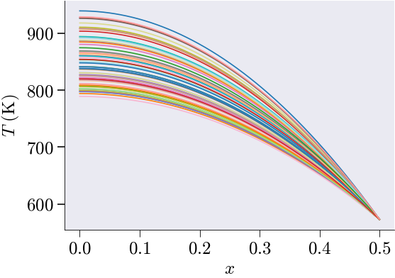
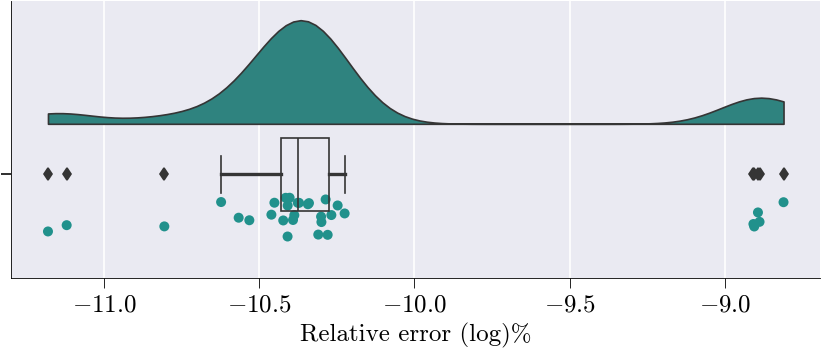
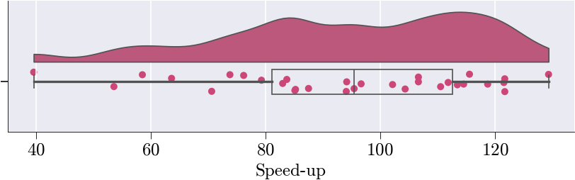

<figure align="left" style="padding: 20px;">
  
<figure align="right" style="padding: 20px;">
  

# scikit-rom (skrom)
A comprehensive Python library Built on scikit-fem to perform projection-based model order reduction  of finite element models, enabling fast and accurate computational simulations through dimensionality reduction techniques.

## ✨ Features
- **Affine parameter decomposition** for efficient online evaluation
- **Hyperreduction techniques** (ECSW/DEIM/SOPT/ECM) for further computational speedup
- **Comprehensive error estimation** and validation tools
- **Visualization tools** for ROM analysis and diagnostics


## 🚀 Quick Start

### Installation

```bash
# Windows
git clone https://github.com/suparnob100/scikit-rom.git
cd scikit-rom

conda create -n scikitrom python==3.11 (we recommend 3.11 so that you can use prebuilt petsc whl)
conda activate scikitrom

# without petsc
pip install -e .

# with petsc (optional)
conda install -c conda-forge -y mkl intel-openmp
conda install -c conda-forge -y msmpi mpi4py

pip install -e .[petsc311] (optional)
```

```bash
# Mac
git clone https://github.com/suparnob100/scikit-rom.git
cd scikit-rom

conda create -n scikitrom python==3.11 (we recommend 3.11 so that you can use prebuilt petsc whl)
conda activate scikitrom

# without petsc
pip install -e .

# with petsc (optional)

Apple Silicon (M1/M2/M3) — recommended
conda install -c conda-forge -y libblas liblapack openblas llvm-openmp

Intel Mac — two options
**Option A (OpenBLAS + OpenMP, safest on conda-forge):**
conda install -c conda-forge -y libblas liblapack openblas llvm-openmp
**Option B (MKL, only if you specifically want MKL on Intel Mac):**
conda install -c conda-forge -y mkl intel-openmp

conda install -c conda-forge -y mpich mpi4py

pip install -e .[petsc311]
```

```bash
# Linux
git clone https://github.com/suparnob100/scikit-rom.git
cd scikit-rom

# Create env (3.11 recommended for petsc4py wheels where available)
conda create -n scikitrom -y python=3.11
conda activate scikitrom

# without petsc
pip install -e .

# with petsc (optional)

# BLAS/OpenMP (Linux equivalent of MKL+intel-openmp)
# Option A (recommended on conda-forge): OpenBLAS + OpenMP runtime
conda install -c conda-forge -y libblas liblapack openblas llvm-openmp

# MPI (Linux equivalent of MS-MPI)
# Option A (recommended): MPICH
conda install -c conda-forge -y mpich mpi4py
# Option B: OpenMPI (use this instead of MPICH if you prefer)
# conda install -c conda-forge -y openmpi mpi4py

pip install -e .[petsc311]   # optional
```

#### NOTE: The petsc4py wheels used by the `petsc311` extra are sourced from the simnibs/petsc4py project:
#### https://github.com/simnibs/petsc4py

## 📖 Documentation

- **[Online Documentation](https://scikitrom.github.io/)** - Complete API reference and tutorials
- **[Getting Started Guide](https://scikitrom.github.io/)** - Step-by-step introduction with examples

## 🏗️ Architecture

```
scikit-rom/
├── docs/
├── examples
│   ├── computational_mechanics
│   │   ├── dynamic
│   │   └── static
│   │       ├── linear
│   │       └── non_linear
│   └── heat_transfer
│       ├── dynamic
│       └── static
│           ├── linear
│           └── non_linear
├── src
│   └── skrom
│       ├── fom
│       ├── problem_classes
│       ├── rom
│       ├── templates
│       └── utils
│           ├── dynamics
│           ├── reduced_basis
│           └── visualization
└── tests/
```

## Minimal Working Example

Here's a simple example of building a ROM for 1D heat conduction:

<!--  -->

<figure align="center" style="padding: 20px;">
  
  
  <figcaption><strong>FOM and ROM</strong></figcaption>
</figure>

```latex
Virtually identical solutions from the full order model (FOM) and reduced order model (ROM)
```

<figure align="center" style="padding: 20px;">
  
  
  <figcaption><strong>Error and Speedup</strong></figcaption>
</figure>

```latex
Error and speedup associated with the reduced order model
```

```python
# ─────────────────────────────────────────────────────────────────────────────
# Imports & Setup
# ─────────────────────────────────────────────────────────────────────────────
from pathlib import Path
notebook_path = Path().resolve()

from skrom.utils.imports import *
from skrom.rom.rom_utils import *
from skrom.rom.rom_error_est import *
from skrom.utils.visualization.color_palette import set_color_palette
from skrom.utils.reduced_basis.svd import svd_mode_selector
from skrom.rom.bilinear_form_rom import BilinearFormROM
from skrom.rom.linear_form_rom import LinearFormROM
from skfem.helpers import grad, dot
import numpy as np
import matplotlib.pyplot as plt
from scipy.stats import qmc  # for Sobol
import time

set_color_palette()

# ─────────────────────────────────────────────────────────────────────────────
# Mesh & BC
# ─────────────────────────────────────────────────────────────────────────────
nx, x_end = 2**17, 0.5
mesh = MeshLine(np.linspace(0, x_end, nx+1))
basis = Basis(mesh, ElementLineP1())
bc_val = 573.15
D = np.where(np.isclose(basis.doflocs[0], x_end))[0]

# ─────────────────────────────────────────────────────────────────────────────
# Material & Source
# ─────────────────────────────────────────────────────────────────────────────
def conductivity(mu: float=0) -> float:
    """$k(μ)=16+μ$."""
    return 16 + mu

def heat_source(beta: float=0) -> float:
    """$Q(β)=35000+β$."""
    return 35000 + beta

# ─────────────────────────────────────────────────────────────────────────────
# Forms & Assembly
# ─────────────────────────────────────────────────────────────────────────────
@LinearForm
def l(v,p):
    """$l(v;p)=∫Q(β)\,v\,dx$."""
    return heat_source(p['beta'])*v

@BilinearForm
def a(u,v,p):
    """$a(u,v;p)=∫k(μ)\,\nabla u·\nabla v\,dx$."""
    return conductivity(p['mu'])*dot(grad(u),grad(v))

def assemble_system(p):
    """Return stiffness, load for params p."""
    return asm(a,basis,mu=p[0]), asm(l,basis,beta=p[1])

# ─────────────────────────────────────────────────────────────────────────────
# Sobol Sampling
# ─────────────────────────────────────────────────────────────────────────────
def generate_sobol(d,n,bounds):
    """Sobol in $[ℓ_i,u_i]$, n=2^m."""
    sampler = qmc.Sobol(d)
    S = sampler.random_base2(m=int(np.log2(n)))
    X = np.empty_like(S)
    for i,(ℓ,u) in enumerate(bounds):
        X[:,i] = ℓ + S[:,i]*(u-ℓ)
    return X

# ─────────────────────────────────────────────────────────────────────────────
# Data Generation & Split
# ─────────────────────────────────────────────────────────────────────────────
param_ranges = [(-4,4),(-1000,1000)]
N_snap = 32
P_train = generate_sobol(2,N_snap,param_ranges)
P_test  = generate_sobol(2,N_snap,param_ranges)
P = np.vstack((P_train,P_test))
mask = np.zeros(2*N_snap,bool); mask[:N_snap]=True
train_mask,test_mask = mask,~mask

# ─────────────────────────────────────────────────────────────────────────────
# Full-Order Solve (Affine)
# ─────────────────────────────────────────────────────────────────────────────
M0,b0 = assemble_system([-15,-34999])  # k=1,Q=1
fos_sols, fos_times = [], []
for μ,β in P:
    t0 = time.perf_counter()
    A = conductivity(μ)*M0
    f = heat_source(β)*b0
    u = basis.zeros(); u[D]=bc_val
    sol = solve(*condense(A,f,x=u,D=D))
    fos_times.append(time.perf_counter()-t0)
    fos_sols.append(sol.copy())
LS = np.array(fos_sols)

# ─────────────────────────────────────────────────────────────────────────────
# Training/Test Solutions & Centering
# ─────────────────────────────────────────────────────────────────────────────
LS_train, LS_test = LS[train_mask], LS[test_mask]
mean_train = LS_train.mean(0)
MS = LS_train - mean_train

# ─────────────────────────────────────────────────────────────────────────────
# POD Mode Selection
# ─────────────────────────────────────────────────────────────────────────────
n_sel, U = svd_mode_selector(MS, tolerance=1e-10, modes=True)
V = U[:,:n_sel]

# ─────────────────────────────────────────────────────────────────────────────
# ROM Form Construction
# ─────────────────────────────────────────────────────────────────────────────
free = np.setdiff1d(np.arange(basis.N),D)
Br = BilinearFormROM(a,basis,V,V,free_dofs=free,mean=mean_train)
Lr = LinearFormROM(l,basis,V,free_dofs=free,mean=mean_train)

# ─────────────────────────────────────────────────────────────────────────────
# Offline ROM Affine Assembly
# ─────────────────────────────────────────────────────────────────────────────
Mr0 = Br.assemble(basis,mu=-15)
br0 = Lr.assemble(beta=-34999)
mean_red = V.T@(M0@mean_train)

# ─────────────────────────────────────────────────────────────────────────────
# Online ROM Solve & Metrics
# ─────────────────────────────────────────────────────────────────────────────
speed, error, LS_rom = [], [], []
fos_test_time = np.array(fos_times)[test_mask]
i = 0

for (μ,β),fos_time in zip(P_test,fos_test_time):
    t0 = time.perf_counter()
    Mr = conductivity(μ)*Mr0
    br = heat_source(β)*br0 - conductivity(μ)*mean_red
    ur = np.linalg.solve(Mr,br)
    uR = reconstruct_solution(ur,V,mean_train)
    dt = time.perf_counter()-t0
    speed.append(fos_time/dt)
    error.append(100*np.linalg.norm(LS_test[i]-uR)/np.linalg.norm(LS_test[i])+1e-15)
    LS_rom.append(uR.copy())
    i = i + 1
LS_rom = np.array(LS_rom)

# ─────────────────────────────────────────────────────────────────────────────
# Error Analysis & Reporting
# ─────────────────────────────────────────────────────────────────────────────
matrix = compute_rom_error_metrics_flat(LS_test,LS_rom)
generate_rom_error_report(matrix)
# plot_rom_error_diagnostics_flat(
#     LS_test,LS_rom,error,speed,
#     sim_axis=['True','ROM'],metrics=matrix
# )
LS_rom = np.asarray(LS_rom)

# Assign the list of speed‐up ratios (FOM time / ROM time) to a variable:
#   speed_up[i] = t_fos_test[i] / t_rom[i]
ROM_speed_up = speed

# Optional: drop the first entry if it's skewed by startup overhead
# (e.g., JIT, memory allocation). Now ROM_speed_up.shape == (N_test - 1,).
ROM_speed_up = ROM_speed_up[1:]

# Assign the list of relative errors (in %) for each test sample:
#   ROM_relative_error[i]
#   = 100 · ‖u_fos – u_rom‖₂ / ‖u_fos‖₂
ROM_relative_error = error

plot_rom_error_diagnostics_flat(
    LS_test,              # full‐order solution snapshots u_fos^(i)
    LS_rom,               # hyper‐ROM solution snapshots u_rom^(i)
    ROM_relative_error,   # list [e_1, …, e_N]
    ROM_speed_up,         # list [s_1, …, s_N]
    sim_axis=['True','ROM'],  # axis labels for true vs. ROM scatter
    metrics=matrix            # the computed metrics matrix
)
```
```
===================
ROM Accuracy Report
===================

Global Errors:
L2 Error:                 8.2505e-06
Relative L2 Error:        5.2750e-12
L∞ Error:                 2.0845e-08
Relative L∞ Error:        2.2554e-11
RMSE:                     4.0286e-09
MAE:                      1.6009e-09

Statistical Fit:
R² Score:                 1.0000
Explained Variance:       1.0000

Error Distribution:
Median Error:             -9.4133e-11
95th Percentile Error:    1.1765e-08

Time/Parameter-Dependent Errors:
Average Rel L2 Error over time/parameter: 2.3908e-12
Max Rel L2 Error over time/parameter: 1.5451e-11
Min Rel L2 Error over time/parameter: 6.5942e-14

```


## 🛠️ Requirements

**Python Version**

* Requires **Python 3.8** or higher

**Core Dependencies**
The project depends on the following libraries:

* `numpy` — Numerical computing
* `scipy` — Scientific computing
* `sympy` — Symbolic mathematics
* `matplotlib==3.8.4` — Visualization
* `scikit-fem[all]` — Finite element method framework with all optional extras
* `sci-mplstyle-package` — Custom scientific matplotlib styles
* `pyamg` — Algebraic multigrid solvers
* `pyDOE` — Design of experiments toolkit
* `ptitprince` — Statistical visualization (e.g., raincloud plots)


## 📚 Applications

scikit-rom can be useful for scenarios requiring many-query simulations:

- **Parameter Studies**: Exploring system response across parameter ranges
- **Optimization**: Design optimization without repeated full-scale simulations
- **Real-time Applications**: Control systems and interactive simulations
- **Uncertainty Quantification**: Monte Carlo studies with many parameter samples
- **Digital Twins**: Efficient real-time model updates

<!-- ## 🎯 Citing scikit-rom

If you use scikit-rom in your research, please cite:

```bibtex
@misc{scikit-rom,
  title={scikit-rom: A Python Library for Reduced-Order Modeling},
  author={Suparno Bhattacharyya},
  year={2025},
  url={https://github.com/suparnob100/scikit-rom}
}
``` -->

<!-- ## 📄 License

This project is licensed under the MIT License - see the [LICENSE](LICENSE) file for details. -->

## 🔗 Related Projects

- [scikit-fem](https://github.com/kinnala/scikit-fem) - Finite element library that scikit-rom builds upon
- [pyMOR](https://pymor.org/) - Model order reduction library
- [libROM](https://www.librom.net/) - C++ library for ROM
- [SROMPy](https://github.com/nasa/SROMPy) - Stochastic reduced order models

## 💬 Support

- **Documentation**: [https://scikitrom.github.io/](https://scikitrom.github.io//)
